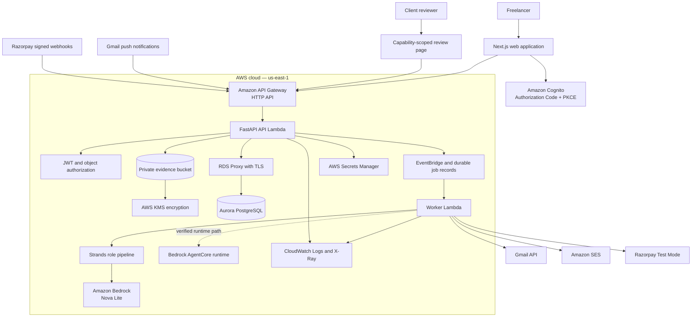
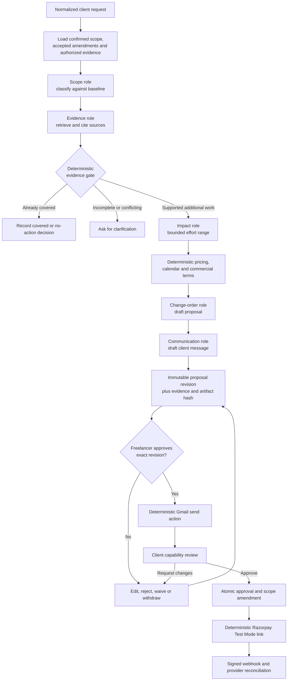
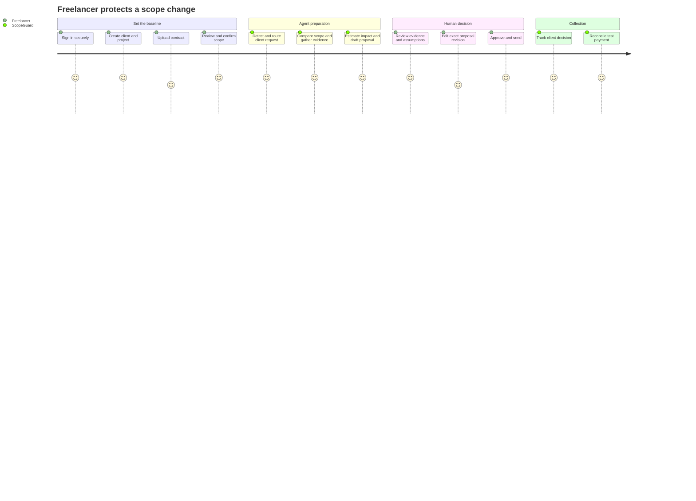

# ScopeGuard

> **Stop doing work you did not get paid for.**

[](LICENSE)


ScopeGuard is an evidence-backed AI agent for independent software freelancers. It watches for client requests, compares each request with the confirmed contract and accepted amendments, gathers exact supporting evidence, estimates impact, and prepares a client-ready change order. It runs the repetitive workflow in the background but stops at the consequential boundary: the freelancer must approve the exact recipient, message, scope, price, and terms before anything is sent.

ScopeGuard was built for the **Professional Agents** track of the **AWS Agents for Humans Hackathon**.

## Submission links

| Resource | Link |
| --- | --- |
| Live application | [scope-guard-web.vercel.app](https://scope-guard-web.vercel.app/) |
| Source code | [github.com/Abbas-Dev-786/scope-guard](https://github.com/Abbas-Dev-786/scope-guard) |
| Architecture | [Architecture section](#architecture) and [detailed architecture notes](docs/ARCHITECTURE.md) |
| Demo fixture | [Acme demo pack](fixtures/acme-demo/README.md) |
| Demo video | Supplied with the hackathon submission |
| License | [MIT](LICENSE) |

> The live application uses Amazon Cognito. Judge credentials should be shared privately in the hackathon submission notes, never committed to this repository.

## Contents

- [The problem](#the-problem)
- [The solution](#the-solution)
- [Architecture](#architecture)
- [How it works](#how-it-works)
- [User flows](#user-flows)
- [Five-minute demo script](#five-minute-demo-script)
- [Technology stack](#technology-stack)
- [Security](#security-and-responsible-agent-design)
- [Live deployment](#live-deployment)
- [Local development](#local-development)
- [Verification](#verification)
- [Implementation boundaries](#implemented-scope-and-verification-boundaries)

## At a glance

| | |
| --- | --- |
| **Who it helps** | Independent software freelancers managing fixed-price client projects |
| **Problem** | Small “can you also…” requests become unpaid work because scope checking, evidence gathering, negotiation, and collection are tedious |
| **Agentic job** | Classify requests, retrieve evidence, estimate impact, and draft a change order and client message |
| **Human decision** | Approve the frozen proposal revision before communication or payment collection |
| **AI stack** | Strands Agents SDK with Amazon Bedrock Nova Lite |
| **Application stack** | Next.js, FastAPI, PostgreSQL, SQLAlchemy, Alembic, Pydantic |
| **AWS stack** | API Gateway, Lambda, Aurora PostgreSQL, RDS Proxy, Cognito, S3, KMS, EventBridge, Secrets Manager, CloudWatch, X-Ray, SES, Bedrock and AgentCore |
| **External providers** | Gmail and Razorpay Test Mode |
| **Currency policy** | INR, integer paise, fixed-price change orders, full test payment after client approval |
| **Safety model** | Evidence first, read-only agent tools, deterministic money/actions, immutable approvals, deny by default |

## The problem

Freelancers rarely lose money because they cannot build the requested feature. They lose money in the administrative gap around it:

- a request arrives in a long email thread;
- someone must find the governing contract language;
- prior approvals and amendments must be checked;
- ambiguous requests must be clarified;
- additional effort and price must be calculated;
- a professional change order must be written and approved;
- payment must be requested, tracked, and reconciled.

That process is repetitive but judgment-heavy. When it is skipped, work starts without a recorded agreement. A generic chatbot is not enough: it can summarize text, but it should not invent evidence, choose a recipient, set a price, send an email, or create a payment request on its own.

## The solution

ScopeGuard turns that fragmented process into one durable workflow:

1. The freelancer creates a client and project, then uploads the contract.
2. ScopeGuard extracts candidate scope items with exact source references.
3. The freelancer reviews and confirms the baseline.
4. New client requests are routed to the correct project.
5. Specialized Strands roles compare the request with confirmed scope and gather evidence.
6. A deterministic evidence gate chooses one of four safe outcomes:
   **covered**, **no action**, **clarification**, or **proposal**.
7. For supported additional work, ScopeGuard estimates impact and deterministically calculates price and terms.
8. The freelancer edits and approves an immutable proposal revision.
9. A deterministic service sends the approved message through Gmail.
10. The client reviews the same revision through a capability-scoped link.
11. Client approval records a scope amendment and prepares a Razorpay Test Mode payment request.
12. Signed webhooks and provider reconciliation update payment state without duplicate collection.

The agent does the preparation. Humans and deterministic services retain authority.

## What makes ScopeGuard different

- **Evidence, not vibes.** Every billable proposal must cite authorized, immutable evidence from the confirmed project context.
- **Ambiguity is a valid answer.** Missing or contradictory evidence produces questions, not a fabricated price.
- **The model never owns the money.** Hours, rates, rounding, tax input, due dates, and totals are validated and frozen by deterministic code.
- **The model never sends.** Agent roles have no Gmail, SES, or Razorpay mutation tools.
- **Approval is content-addressed.** The exact proposal revision, evidence, recipient, terms, and artifact hash are approved together.
- **Background work is durable.** Jobs, leases, retries, idempotency keys, outbox entries, uncertain outcomes, and audit events survive worker failures.
- **Tenant identity is server-derived.** Cognito claims establish ownership; tenant IDs supplied by a browser are never trusted.

## Architecture

### System architecture



### Agent and decision flow



### Authority boundary

| Responsibility | Strands agent | Deterministic service | Human |
| --- | :---: | :---: | :---: |
| Read authorized contract and request context | ✓ | ✓ | |
| Classify scope and explain reasoning | ✓ | | |
| Identify evidence and contradictions | ✓ | validates IDs and ownership | |
| Estimate an effort range | ✓ | validates bounds | |
| Calculate price, tax input, dates and terms | | ✓ | configures policy |
| Draft proposal and client message | ✓ | validates schema and recipient | edits |
| Confirm the contractual baseline | | records immutable version | ✓ |
| Approve the exact outgoing revision | | verifies hash and current version | ✓ |
| Send email or create payment link | | ✓ | authorizes beforehand |
| Accept or reject a change order | | records one-time capability action | ✓ client |

## How it works

### 1. Secure onboarding and project boundaries

The browser signs in with Amazon Cognito Authorization Code flow using S256 PKCE and validated OAuth state. The API verifies the JWT and derives the tenant from trusted claims. A verified email is required for onboarding.

The freelancer then defines:

- clients and authorized contacts;
- projects, timezones, base contract values and statuses;
- versioned commercial preferences such as hourly rate, minimum charge and rounding increment;
- provider connections and explicit routing bindings.

Every protected query includes tenant ownership. Cross-tenant objects return not found rather than leaking existence.

### 2. Contract ingestion and human-confirmed scope

Contract files are uploaded directly from the browser to a private S3 bucket through a constrained presigned POST. The upload grant fixes the object key, content type, exact size and expiry. Completion verifies object metadata, size and SHA-256 before extraction.

Supported input:

| Format | MIME type |
| --- | --- |
| PDF | `application/pdf` |
| DOCX | `application/vnd.openxmlformats-officedocument.wordprocessingml.document` |
| Plain text | `text/plain` |
| Markdown | `text/markdown` |

Extraction is bounded to 10 MiB, 100 pages, 250,000 characters and a limited expanded DOCX size. Encrypted PDFs, scanned-only PDFs, malformed archives and unsupported formats fail closed with an actionable reason.

Extracted text becomes chunks and **candidate** scope items. It is not contractual truth yet. The freelancer chooses and corrects candidates, then confirms an immutable effective-scope version whose items retain exact source-chunk provenance.

### 3. Request ingestion and routing

Provider events are normalized into a canonical envelope and deduplicated independently from the underlying business request. Explicit thread or resource bindings take precedence. Ambiguous routing remains visible for human assignment and can be replayed exactly once after resolution.

The request lifecycle supports clarification, merge and split operations so one email can contain multiple changes and the same request can appear across multiple deliveries.

### 4. Bounded Strands reasoning

ScopeGuard creates fresh role instances for each job. Roles use Amazon Bedrock Nova Lite at temperature zero and return strict Pydantic structured output:

| Role | Responsibility |
| --- | --- |
| Contract Structure | Extract candidate scope items; never confirm them |
| Scope | Classify a request against confirmed scope and amendments |
| Evidence | Retrieve authorized evidence and report coverage or contradictions |
| Impact | Produce bounded low/recommended/high effort estimates and dependencies |
| Change Order | Draft factual proposal content from validated inputs |
| Communication | Draft a client message for the authorized recipient |

Unknown output fields are rejected. Evidence IDs are checked against the current tenant and project. Active HTML is rejected. One bounded repair attempt is allowed; unresolved schema errors or missing evidence become a safe clarification/failure state.

Per-analysis controls include node/tool deadlines, read limits, token budgets, attempt limits, a deployment-wide budget, a tenant budget and reviewed model-price freshness. If pricing configuration is missing or stale, model work pauses instead of running without a cost ceiling.

### 5. Evidence gate and deterministic commercial policy

The model output is advisory. A deterministic gate rechecks:

- baseline completeness;
- evidence coverage and contradictions;
- evidence ownership and source versions;
- confirmed scope items;
- accepted amendments;
- pending requests;
- request and scope revision freshness.

Only supported additional work reaches proposal creation. Pricing uses Python `Decimal` and integer paise—never binary floating-point or model-generated totals. The frozen snapshot contains the rate/preference version, calendar version, hours, total, tax input, due policy, payment condition and schedule impact.

### 6. Immutable approval and client review

The freelancer can edit the proposal, but each edit creates a new revision and hash. Approval applies only to the current exact revision. A stale command cannot approve newer content.

The outgoing Gmail action receives frozen deterministic values; it does not accept a model-selected recipient or amount. The client opens a one-time capability URL, exchanges it for a scoped secure session, and can:

- approve;
- reject;
- request changes;
- view a read-only receipt and payment-link status.

Client approval atomically records the accepted revision, adds an amendment to effective scope, records approved revenue and creates the payment intent. Replays do not duplicate those facts.

### 7. Test payment collection and reconciliation

Razorpay is intentionally restricted to **Test Mode** for the hackathon. Stable internal references correlate the approved proposal with the payment request and provider observations. Webhooks are signature-verified, deduplicated and checked for account, environment, order, amount and currency consistency.

Out-of-order or conflicting provider events cannot move payment state backward. Uncertain create-link outcomes are reconciled before retry, preventing blind duplicate links.

### 8. Durable execution and recovery

The database owns business truth. Workers use leases and fencing generations so a stale worker cannot commit after losing ownership. External actions have idempotency keys and explicit states including unknown outcome. Accepted events, audit records, immutable revisions and provider observations are committed before downstream effects are considered complete.

Operational APIs expose job health, safe retry, uncertain-action resolution, integration health and bounded workflow traces without revealing raw prompts or chain-of-thought.

## User flows

### Freelancer flow



### Client flow

1. Receive the freelancer-approved proposal link.
2. Open the capability-scoped review page without creating a ScopeGuard account.
3. Review requested change, deliverables, exclusions, assumptions, evidence-backed explanation and payment terms.
4. Approve, reject or request changes.
5. After approval, open the Razorpay Test Mode payment link.
6. Reopen the receipt page to see the reconciled result.

### Background agent flow

1. Receive a durable `analysis.prepare` job.
2. Acquire a fenced lease and load the exact request/scope versions.
3. Reserve tenant and deployment model budgets.
4. Run the read-only Strands role pipeline.
5. Validate structured output, evidence IDs, recipient and limits.
6. Persist a proposal, covered decision or clarification.
7. Reconcile actual model usage and release the job lease.
8. Notify the human only when a decision or integration problem requires attention.

## Product surfaces

| Route | Purpose |
| --- | --- |
| `/sign-in` and `/auth/callback` | Cognito PKCE authentication |
| `/onboarding` | Create the verified owner workspace |
| `/clients` and `/clients/[id]` | Manage clients and authorized contacts |
| `/projects` and `/projects/[id]` | Manage project boundaries and commercial context |
| `/projects/[id]/contract` | Upload contracts and inspect document processing |
| `/projects/[id]/scope` | Extract, correct and confirm effective scope |
| `/projects/[id]/routing` | Resolve ambiguous provider-to-project mappings |
| `/proposals` | View analysis decisions and assemble proposals |
| `/proposals/[id]` | Edit, version, approve and send an exact proposal |
| `/integrations` | Connect and monitor Gmail |
| `/settings` | Create versioned commercial preferences |
| `/c` | Public capability-scoped client review and receipt |

## Five-minute demo script

The checked-in [Acme fixture](fixtures/acme-demo/README.md) contains synthetic data only and is safe for recording.

1. **Problem — 30 seconds:** show the Acme SOW and explain how an informal extra request becomes unpaid work.
2. **Baseline — 45 seconds:** open the Acme project, upload [`sow.md`](fixtures/acme-demo/sow.md), extract candidates and confirm the selected scope.
3. **Agent — 60 seconds:** introduce an out-of-scope request such as “Add Microsoft Entra ID SSO,” then show the Scope and Evidence decisions, exact citations, impact range and trace summary.
4. **Human approval — 60 seconds:** open the prepared proposal, edit a field, save a new revision, and approve the exact email and terms.
5. **Client experience — 45 seconds:** open the one-time client link and show approve/request-changes behavior.
6. **Collection — 30 seconds:** show the Razorpay Test Mode payment link and read-only receipt.
7. **Safety — 30 seconds:** close with the authority table: agents reason, deterministic services act, and humans authorize commitments.

For a reliable recording, pre-seed the synthetic request and provider state; do not expose real client data, OAuth tokens, capability tokens or payment credentials.

## Hackathon judging alignment

| Criterion | ScopeGuard evidence |
| --- | --- |
| **Technological implementation** | Six specialized Strands roles, structured outputs, deterministic gates, durable execution, Bedrock evaluation, deployed AWS stack and AgentCore runtime smoke path |
| **Design** | Complete freelancer workspace plus a no-account client review experience, versioned proposals and visible evidence/assumptions |
| **Potential impact** | Protects freelancer time and revenue by reducing the administrative friction that causes unapproved work |
| **Creativity and originality** | Treats agentic AI as a bounded evidence investigator and proposal preparer—not an autonomous sender or financial authority |
| **Presentation** | Synthetic repeatable fixture, live application, two audience flows, safe trace UI and a focused five-minute story |

## Technology stack

### Application

| Layer | Technology |
| --- | --- |
| Web | Next.js 16, React 19, TypeScript |
| API | FastAPI, Mangum, Pydantic |
| Domain and persistence | Python 3.11, SQLAlchemy 2, Alembic |
| Database | PostgreSQL locally; Aurora PostgreSQL 17.7 in staging |
| Agent framework | Strands Agents SDK |
| Model | Amazon Bedrock `amazon.nova-lite-v1:0` |
| Agent deployment | Bedrock AgentCore runtime readiness path |
| Contracts | OpenAPI with generated TypeScript definitions |
| Tooling | uv, pnpm, Ruff, mypy, pytest, ESLint |

### AWS services

| Service | Use |
| --- | --- |
| Amazon Cognito | User pool authentication and OAuth PKCE |
| Amazon API Gateway | HTTP API, CORS and Lambda ingress |
| AWS Lambda | API, durable worker and database migration functions |
| Amazon Aurora PostgreSQL | Durable tenant, scope, workflow, approval and payment state |
| Amazon RDS Proxy | TLS database connection pooling for Lambda |
| Amazon S3 | Private contract/evidence objects and constrained uploads |
| AWS KMS | Encryption for evidence and operational data |
| Amazon EventBridge | Internal events and scheduled worker wake-up |
| AWS Secrets Manager | Provider and application credentials |
| Amazon Bedrock | Nova Lite inference for Strands roles |
| Amazon Bedrock AgentCore | Deployed bounded readiness runtime |
| Amazon SES | Verified-address transactional notifications |
| CloudWatch and X-Ray | Encrypted logs, correlation and runtime traces |
| AWS CloudFormation | Reproducible foundation and staging infrastructure |

## Security and responsible-agent design

ScopeGuard is designed around the fact that contracts, email and client comments are untrusted input.

| Risk | Control |
| --- | --- |
| Prompt injection in evidence | Provider content is treated as data; role prompts reject embedded instructions |
| Agent-triggered external action | Reviewed connector manifest gives agents read-only tools and no provider credentials |
| Cross-tenant access | Server-derived tenant identity, ownership filters and database constraints |
| Invented evidence | UUID references must exist inside the authorized project and immutable source version |
| Wrong recipient | Recipient must match an authorized contact for the project |
| Wrong price | Deterministic Decimal/paise calculation from frozen human-configured preferences |
| Stale approval | Row versions, business revisions, content hashes and exact revision approval |
| Duplicate send or payment link | Idempotency keys, action records and unknown-outcome reconciliation |
| Forged client/payment callback | Capability scoping, token expiry/revocation and webhook signature verification |
| Unsafe document | Type/size/page/character/expansion limits and fail-closed extraction |
| Model runaway or cost surprise | Node deadlines, attempts, token limits and reviewed price/budget reservations |
| Sensitive observability | Correlation IDs and safe summaries; no raw chain-of-thought |

ScopeGuard identifies differences from recorded scope. It does not determine legal enforceability, calculate tax obligations, or initiate real payments in this hackathon build.

## Live deployment

| Component | Current verified state |
| --- | --- |
| Web | Vercel production deployment at [scope-guard-web.vercel.app](https://scope-guard-web.vercel.app/) |
| API | AWS API Gateway at `https://sj3udtpf6l.execute-api.us-east-1.amazonaws.com` |
| Region | `us-east-1` |
| CloudFormation | Foundation and staging stacks `UPDATE_COMPLETE` |
| Lambda deployment | Revision `43`; API, worker and migration functions active |
| Container image | `phase7-20260914-m11-prod-cors` |
| Database | Aurora PostgreSQL 17.7 through TLS-required RDS Proxy |
| Authentication | Cognito code flow with localhost and production callback/logout URLs |
| CORS | Production Vercel origin allowed by API Gateway, FastAPI and S3 |
| Health | `/health/live` and `/health/ready` return HTTP 200 |

## Local development

### Prerequisites

- Python 3.11
- [uv](https://docs.astral.sh/uv/) 0.11 or newer
- Node.js 20.9 or newer
- pnpm 10
- Docker with Compose
- AWS credentials only for optional live AWS/provider paths

### Install

```bash
git clone https://github.com/Abbas-Dev-786/scope-guard.git
cd scope-guard
cp .env.example .env

uv sync --locked --dev
pnpm install --frozen-lockfile
docker compose up -d postgres
uv run alembic upgrade head
```

PowerShell users can replace the copy command with:

```powershell
Copy-Item .env.example .env
```

### Start the applications

API:

```bash
uv run uvicorn services.api.app:app --reload --port 8000
```

Web, in another terminal:

```bash
pnpm dev:web
```

Open [http://localhost:3000/sign-in](http://localhost:3000/sign-in).

### Local development identity

Manual development tokens are intentionally restricted to the development environment. In `.env`:

```dotenv
SCOPEGUARD_ENVIRONMENT=development
SCOPEGUARD_ALLOW_DEV_AUTH=true
NEXT_PUBLIC_ALLOW_MANUAL_TOKEN=true
```

Provision the synthetic owner:

```bash
uv run python scripts/bootstrap_owner.py \
  --cognito-sub 00000000-0000-4000-8000-000000000001 \
  --verified-email owner@example.com
```

Use this local-only token on the sign-in page:

```text
dev:00000000-0000-4000-8000-000000000001
```

Never enable manual-token authentication in staging or production.

### Important environment variables

Copy [`.env.example`](.env.example) for the complete list.

| Variable | Purpose |
| --- | --- |
| `SCOPEGUARD_DATABASE_URL` | PostgreSQL connection |
| `SCOPEGUARD_COGNITO_*` | API-side Cognito verification |
| `SCOPEGUARD_BEDROCK_MODEL_ID` | Reviewed Bedrock model |
| `SCOPEGUARD_MODEL_*` | Model price freshness and per-token cost |
| `SCOPEGUARD_*_TOKEN_LIMIT_PER_DAY` | Tenant and deployment model budgets |
| `SCOPEGUARD_CONTRACT_OBJECT_*` | Private S3/KMS evidence storage |
| `SCOPEGUARD_GMAIL_*` | Gmail OAuth, callback and watch configuration |
| `SCOPEGUARD_RAZORPAY_*` | Razorpay Test Mode adapter |
| `SCOPEGUARD_SES_*` | Verified notification sender |
| `NEXT_PUBLIC_API_BASE_URL` | Browser API origin |
| `NEXT_PUBLIC_COGNITO_*` | Cognito hosted login and callback |

Do not commit `.env`, OAuth credentials, client capability URLs, raw email content or payment secrets.

## API overview

The generated OpenAPI contract is stored at [`packages/shared-schemas/openapi.json`](packages/shared-schemas/openapi.json), and frontend types are generated into [`apps/web/lib/generated/api.d.ts`](apps/web/lib/generated/api.d.ts).

Major API groups:

- identity, onboarding and versioned preferences;
- clients, contacts and projects;
- document grants, upload completion, download, extraction and candidates;
- effective scope confirmation and retrieval;
- integration-event routing, assignment and replay;
- requests, clarification, merge, split and analysis;
- decisions, evidence and safe workflow traces;
- change-order assembly, revision, approval, rejection, waiver and withdrawal;
- Gmail connect, callback, reconnect, disconnect and health;
- payment-link creation, replacement and reconciliation;
- capability exchange, client review, approval and receipt;
- Gmail and Razorpay webhooks;
- operational job, action and health endpoints.

Regenerate the contract after changing routes:

```bash
pnpm contracts:generate
```

## Verification

Current worktree verification:

```text
uv run pytest       87 passed, 4 skipped
pnpm lint           passed
pnpm typecheck      passed
pnpm build          passed
cfn-lint            passed for the CloudFormation templates
```

The four default skips are environment-gated PostgreSQL cases. A clean PostgreSQL 16.6 database was separately migrated through Alembic head and those four integration checks passed.

Additional recorded evidence:

- two deployed Cognito identities were used to verify owner access and cross-tenant denial;
- the staging API and database readiness endpoints passed through the private RDS Proxy path;
- the AgentCore runtime returned the bounded readiness response on three consecutive invocations;
- a frozen 120-case synthetic evaluation has a 60-case held-out split;
- three live Bedrock classifier-harness runs produced 28/28 correct proposal decisions per run, precision 1.0, positive recall 1.0, zero abstentions and zero invalid references;
- production API and S3 CORS preflights pass while an untrusted origin is rejected.

See [`docs/implementation-evidence`](docs/implementation-evidence/) for commands, boundaries and sanitized observations.

## Implemented scope and verification boundaries

| Area | Implementation | Live/provider evidence |
| --- | --- | --- |
| Core domain, tenancy and migrations | Implemented through migration `0014` | Staging and clean local database verified |
| Contract upload/extraction/scope confirmation | Implemented | Production-origin S3 and API flow configured and preflight verified |
| Strands analysis and deterministic evidence gate | Implemented | AgentCore smoke path and three-run Bedrock evaluation recorded |
| Proposal revision, freelancer approval and client review | Implemented | Deployed review exchange and page contract exercised |
| Gmail lifecycle | OAuth, read/watch/send services and recovery implemented | OAuth/watch setup observed; complete controlled read/send journey remains an acceptance item |
| SES notifications | Implemented | Provider accepted a controlled send; inbox receipt remains an acceptance item |
| Razorpay collection | Test Mode adapter, signed webhook and reconciliation implemented | One fully correlated ScopeGuard-created payment round trip remains an acceptance item |
| Reminders, privacy lifecycle and release drills | Designed in later phases | Post-hackathon completion and evidence |

This table deliberately separates implemented code from provider acceptance. Mocked success or an unrelated provider transaction is not presented as proof of a complete live workflow.

## Repository structure

```text
scope-guard/
├── apps/web/                    # Next.js freelancer and client-review UI
├── services/
│   ├── agents/                 # Strands roles, schemas, gates, limits and evaluation
│   ├── api/                    # FastAPI routes, auth and application services
│   ├── connectors/             # Deny-by-default provider capability policy
│   ├── contracts/              # Upload, extraction, evidence and scope services
│   ├── domain/                 # Canonical entities, states, money and terms
│   ├── integrations/           # Gmail, SES and Razorpay adapters
│   ├── payments/               # Collection and reconciliation rules
│   └── workers/                # Durable jobs, leases, retries and recovery
├── migrations/                 # Alembic and explicit SQL migrations
├── infra/                      # CloudFormation and Lambda/AgentCore images
├── packages/shared-schemas/    # Generated OpenAPI contract
├── fixtures/acme-demo/         # Synthetic repeatable demo data
├── tests/                      # Unit and integration verification
├── docs/                       # Product, technical, security and evidence records
└── plans/                      # Phased implementation and acceptance matrix
```

## Design documents

- [Product requirements](docs/PRD.md)
- [Technical design](docs/TDD.md)
- [Architecture](docs/ARCHITECTURE.md)
- [Threat model](docs/THREAT_MODEL.md)
- [Operations and recovery](docs/OPERATIONS.md)
- [IAM requirements](docs/IAM_REQUIREMENTS.md)
- [Acceptance matrix](plans/ACCEPTANCE_MATRIX.md)
- [Implementation plan](plans/README.md)
- [Live-gate operator runbook](docs/implementation-evidence/live-gate-operator-runbook.md)

## Roadmap

- complete the controlled Gmail read/send and SES receipt evidence;
- complete one ScopeGuard-created Razorpay Test Mode approval-to-payment round trip;
- add overdue reminder approval/dismissal and privacy export/deletion UI;
- complete full clean-cloud recreation and restore drills;
- evaluate optional GitHub and Slack evidence connectors;
- add team workspaces, delegated approvers, more currencies and flexible commercial policies after the single-freelancer MVP.

## License

ScopeGuard is open source under the [MIT License](LICENSE).

---

Built for people whose best work is the work only they can do—not the repetitive administration around it.
