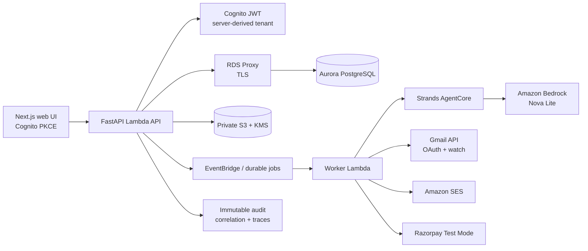

# ScopeGuard architecture

ScopeGuard is a professional-workflow agent: it analyzes a scope-change request, cites source evidence, prepares a proposal, and pauses for explicit human approval before external communication or payment collection.

The agent has no direct consequential provider tools. Deterministic services own approval, email, payment-link creation, webhook verification, tenant authorization, idempotency, and recovery transitions.