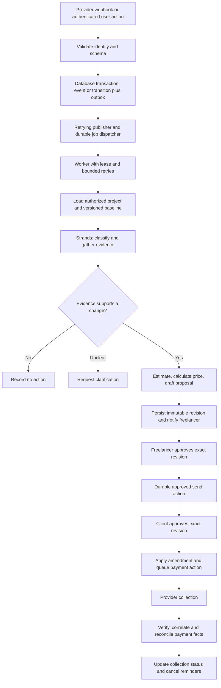

**ScopeGuard architecture review — 7 September 2026**

**Revision status — 7 September 2026:** This is the historical review of PRD/TDD version 1.0. The findings and line references below describe that reviewed snapshot, not the current files. Version 1.1 addresses all 32 findings at specification level; see [REVIEW_RESOLUTION.md](REVIEW_RESOLUTION.md) for the design-to-acceptance mapping. Application implementation, account eligibility and executable verification remain pending.

Reviewed every section of [PRD.md](PRD.md) (36 sections, 2,021 lines) and [TDD.md](TDD.md) (79 sections, 3,522 lines), plus [hackathon.md](../hackathon.md) for local submission context. Provider assumptions were checked using Context7 and official documentation. References below point to the original documents; section numbers are stable locators and line numbers describe the files at review time.

**Assessment: a coherent product concept and a promising architecture outline, but not yet a sufficiently precise implementation specification.** The happy path is extensively described. The largest remaining work is defining what happens between its stages: atomic state changes, retries, stale approvals, incomplete evidence, tenant boundaries, and payment reconciliation.

This is a documentation review. The workspace contains no application implementation to verify. A missing safeguard means it is not specified in the reviewed documents, not that a deployed system has been proven vulnerable. Provider access was checked against documentation, not against the project's accounts. No application tests or cloud operations were performed.

Useful decisions to retain are the short workflows backed by durable business state (TDD §3), deterministic pricing (TDD §20), contract extraction followed by human review (TDD §44), provider signature validation (TDD §15), tool-side authorization (TDD §56), and the separation of approved revenue from guaranteed counterfactual savings (PRD §19).

**Priority interpretation**

| Priority | Meaning |
| --- | --- |
| P0 | Resolve before treating the approval/payment path as dependable, even in the test-mode MVP. |
| P1 | Resolve before a real-user pilot; some also affect the demo directly. |
| P2 | Specify before broader rollout, or explicitly constrain the MVP to avoid the issue. |

The 32 findings below include both direct contradictions and missing design decisions. Priorities concern potential impact, not evidence of an existing incident.

**1. P0 — Persisting state and publishing its event are separate, unprotected operations.**

Evidence: TDD §14, lines 659–666; §31, lines 1424–1437; §35, lines 1530–1539; §66, lines 2814–2819.

The webhook and approval flows persist data and then publish an event. A crash after the database commit but before publication leaves an accepted request or approval with no next workflow. A provider retry may then encounter the existing event ID and be discarded as a duplicate. The reverse boundary can also duplicate dispatch when publication succeeds but its acknowledgement is lost. The existing unique event key does not close either window.

Specify a transactional outbox: the business transition, audit record, and outgoing event are committed together. A retrying publisher marks delivery separately; consumers deduplicate their own processing. Record publication attempts and surface permanently failing records. Define how an S3 raw payload and its database reference are recovered if only one write succeeds.

Verification: stop execution immediately after the database commit, restart it, and prove the intended next workflow still runs once at the business-operation level.

**2. P0 — An idempotency-key string does not make Gmail sending or payment-link creation idempotent.**

Evidence: TDD §32, lines 1446–1457; §36, lines 1560–1573; §58, lines 2542–2563; §60, lines 2630–2644.

Both flows call the provider before storing the returned ID. If the provider succeeds and the response or subsequent database write is lost, the system cannot distinguish failure from success. Retrying can send another email or create another collection link. Falling back from MCP to REST after an uncertain write can repeat the same side effect.

Add an external-action record with a unique business key, approved revision, request digest, provider reference, attempt state, and an explicit UNKNOWN_OUTCOME state. Persist intent before execution. Define provider-specific reconciliation before retrying uncertain writes; do not assume an arbitrary idempotency header is supported. Razorpay documents a unique `reference_id` with a 40-character limit: map the internal key to a valid provider reference and define recovery from duplicate-reference responses. [Razorpay Payment Link creation](https://razorpay.com/docs/api/payments/payment-links/create-standard/?preferred-country=IN).

Verification: simulate successful send/create followed by a timeout and crash; recovery must reconcile or request review instead of blindly repeating the write. An email Message-ID alone must not be presented as an exactly-once guarantee.

**3. P0 — Approval hashes exist, but the approval-to-execution contract remains incomplete.**

Evidence: TDD §31, lines 1416–1437; §32, lines 1449–1453; §33, lines 1474–1488; schema, lines 2132–2176; §59, lines 2567–2594.

The schema records versions and hashes, which is useful. However, the freelancer approval request supplies no expected version/hash; only the amount is explicitly frozen; the final change order is created after approval; and the client token contains no revision/hash. Recipient, subject, message body, attachments, scope baseline, payment terms, and deliverables are not explicitly part of the immutable approval envelope.

A user can review revision 1 while another edit produces revision 2. A status-only check may authorize content the user never saw. A mutable Gmail draft creates another route for the sent content to differ from the approved content.

Create an immutable proposal revision and canonical content digest before approval. Require expected revision on approve/edit, store approval and transition atomically, and send exactly the approved artifact. Bind client tokens to that revision. Changes invalidate prior approvals, unsent actions, and old tokens. Distinguish content revisions from ordinary row-lock versions.

Verification: concurrent edit/approve, old browser tabs, edited provider drafts, and old client links must never authorize a different proposal.

**4. P0 — Tenant and project isolation is a principle without an end-to-end enforcement design.**

Evidence: PRD §12.1, line 630; TDD §17; §21, lines 1001–1018; schema, lines 1869–1937 and 2005–2026; §56.

Project ownership is checked in one approval example, but there is no equivalent authorization contract for evidence retrieval, direct message/thread reads, integration selection, document downloads, public reads, runtime invocation, memory, or background workers. The normalized event has an integration ID, while the stored external-event schema omits it. Independent project/client/integration foreign keys do not establish common ownership by themselves.

A project-scoped search can still leak information if a subsequent get-thread call accepts an unrelated ID, or if a shared runtime reuses another user's connector credentials. Agent role allowlisting cannot solve object authorization.

Derive user, project, integration, and permitted resource set from authenticated server context. Carry trusted tenant identity into every job and tool call. Enforce ownership on every read/write and returned object, including S3 access and caches. Define runtime session isolation and reject cross-owner bindings. Use database constraints and/or row-level policies as appropriate, with application checks regardless.

Verification: two users and multiple projects, including guessed IDs and adversarial tool parameters; no cross-boundary content or mutation should succeed.

**5. P0 — The proposed GitHub tool filter does not establish read-only access.**

Evidence: TDD §10, lines 565–571; §50, lines 2380–2396.

Allowing names matching `*issue*`, `*pull_request*`, `*commit*`, and `*repository*` while rejecting only `*create*`, `*delete*`, and `*merge*` can admit mutations named update, edit, close, assign, or other verbs. Discovering names dynamically is useful for compatibility, but must not automatically expand the approved capability set.

Use explicit, reviewed read capabilities mapped to concrete tool names for a pinned server/version, reject unknown capabilities, and use provider credentials that independently restrict writes. Test the actual filtering semantics of the chosen SDK version. Treat the current snippet as conceptual pseudocode, not a security policy ready to copy.

Verification: synthetic tools such as `update_issue` and newly discovered mutation tools are denied even when their names match an allowed resource pattern.

**6. P0 — Money units and numeric types are undefined at the provider boundary.**

Evidence: TDD §20, lines 967–975; §27, lines 1262–1277; §36, lines 1576–1578; §38, lines 1607–1616; payment schema, lines 2191–2205.

The UI and internal examples use `15000` for ₹15,000, and the payment event also says `amount: 15000` without identifying units. Razorpay APIs require currency subunits; ₹15,000 is 1,500,000 paise. The normalized event could intentionally convert units, but no conversion contract is specified. [Razorpay currency units](https://razorpay.com/docs/payments/international-payments/currency-conversion/?preferred-country=IN).

The pricing example also annotates hours as `float` and multiplies it by `Decimal`, which raises a TypeError for actual float input. Rounding settings appear later but are not applied by that function. A minimum fee could conceal negative or otherwise invalid model estimates.

Choose an explicit Money representation, preferably integer minor units plus currency at payment boundaries, and decimal-safe effort/rates. Specify rounding order, bounds, finite values, currency compatibility, tax treatment, and conversion in both directions. Keep the MVP INR-only if broader support is unnecessary.

Verification: fractional hours, invalid/negative/nonfinite estimates, rounding boundaries, and a ₹15,000 create-and-webhook round trip with exact stored equality.

**7. P0 — New evidence cannot visibly overturn the initial scope decision.**

Evidence: TDD §19, lines 901–936; §23, line 1113; §24, lines 1164–1183; PRD §10.2, line 391.

AMBIGUOUS and potential-change requests both flow through evidence, impact, pricing, and proposal creation. There is no documented branch after evidence gathering for an existing approval, contradictory promise, insufficient source coverage, or evidence that the work is already included. The Evidence Agent returns contradictory evidence, but no rule consumes it. The graph also omits explicit routes for PREVIOUSLY_APPROVED and NOT_A_SCOPE_REQUEST.

A preliminary false positive can become a polished billable proposal even after the Evidence Agent finds the contrary. Human approval is still present, but the system is manufacturing a misleading decision rather than reducing administrative work.

Add a validated assessment gate after evidence gathering. Route supported changes to impact analysis; covered/approved work to no action; unresolved conflicts to a clarification decision without a final-price proposal. Require trusted evidence references and explicit completeness status before escalation.

Verification: an initially plausible scope change with a later retrieved approved change order must produce no new billable proposal.

**8. P1 — The approved scope baseline has no complete version or amendment lifecycle.**

Evidence: PRD §9, line 331; §21, line 1421; TDD §36; §44, line 1784; schema, lines 1883 and 1975–1990.

The main product journey updates scope after client approval, but the PRD categorizes automatic updates as P1, and Workflow C only creates a payment link. `confirmed_scope_version` exists without a scope-version entity, historical membership, effective dates, supersession rules, or a linkage from scope items to approved change orders. The model can search approved orders, so rediscovery is not inevitable; the gap is that the effective-scope calculation is undefined.

Define effective scope as the confirmed baseline plus applicable approved amendments, with explicit precedence and status rules. Either materialize this atomically or make every read combine both sources. Record the baseline version used for each assessment/proposal and recheck it before approval. Define whether work becomes authorized at client approval, deposit, or payment, and how cancellation changes the effective scope.

Verification: approve an amendment, then receive the same request again and reanalyze an older pending proposal. Both must use the new scope consistently.

**9. P1 — Gmail ingestion is missing the operational synchronization loop.**

Evidence: TDD §8, lines 471–487; §15, line 697; integration schema, lines 1890–1904.

The design mentions `watch` and history IDs but not watch expiry, renewal ownership, durable sync checkpoints, pagination, concurrent notifications, reconnect backfill, or history expiration. Google requires watch renewal at least every seven days, recommends daily renewal, and documents that notifications may be dropped. Expired history IDs require full synchronization. [Gmail push](https://developers.google.com/workspace/gmail/api/guides/push), [Gmail synchronization](https://developers.google.com/workspace/gmail/api/guides/sync).

Define a mailbox sync worker with a persisted cursor and watch expiry, renewal scheduling, periodic catch-up, and an explicit recovery mode. Advance the cursor only after all corresponding normalized messages are durably recorded. Serialize or safely coalesce mailbox sync jobs. A Pub/Sub notification ID must not be confused with a Gmail message ID.

Verification: expire a watch, omit a push, deliver history notifications out of order, and force a history 404. No relevant message should silently disappear or be processed twice as a new request.

**10. P1 — Event deduplication does not cover repeated communications or repeated business requests.**

Evidence: TDD §13, lines 642–652; §16; communication schema, lines 2033–2047; §58; PRD §24, lines 1530–1536.

The unique `(provider, external_event_id)` key handles repeat delivery of a provider event. Separate notifications can expose the same Gmail message; edited GitHub activity can refer to the same request; a client can ask the same thing in Slack and email. Each has a different event identity. There is no stable request entity, communication-level uniqueness, or many-to-many relationship between requests and evidence/messages.

Separate delivery identity, resource identity, and business-request identity. Document provider-specific dedupe scope including account/integration where needed. Deduplicate normalized messages by integration and resource ID, and associate repeated requests with an existing assessment/change order. Treat semantic merging as a reviewable hypothesis so distinct requests are not silently combined. Exclude self-generated drafts, sent emails, reminders, and irrelevant update types from new-request triggers.

Verification: replay overlapping history ranges and repeat one request across two channels; produce one active proposal, while preserving genuinely distinct requests.

**11. P1 — Email-address-to-project mapping fails for multiple projects with the same client.**

Evidence: TDD §17, lines 740–751; binding uniqueness, lines 1931–1936; PRD §6 and §16.6.

The binding uniqueness rule permits a configured contact/channel/repository to belong to only one project per connection. Freelancers commonly have a new build and maintenance project for the same client, or share a repository/channel across workstreams. One sender address cannot determine which contract governs a request. Removing the uniqueness constraint alone would turn a restriction into ambiguous routing.

Choose and document a routing policy: explicit thread/label binding, project alias, or human mapping when multiple candidates remain. Preserve unmapped and ambiguous events for reassignment and replay. Use immutable provider IDs where available, and define behavior for renames, shared channels, archived projects, and multiple client contacts.

Verification: a single sender linked to two active projects must never be assigned by arbitrary first-match behavior.

**12. P0 — Payment verification requires an identity that may not yet be known.**

Evidence: TDD §36, lines 1569–1573; §38, lines 1609–1616; §39, lines 1634–1643; payment schema, lines 2194–2196.

Creation stores a Payment Link ID. The incoming normalized event identifies a payment ID. Verification then requires the provider payment ID to be known, but no step explains how a new payment becomes associated with the known link. The normalized example drops link/order/account context. A fast payment event could also arrive before local link persistence completes.

Define a correlation contract using the provider account/environment, payment-link ID, related order, approved revision, and verified provider data. Razorpay's `payment_link.paid` payload includes link, order, and payment objects, making it a useful candidate for this path; it still requires validation and replay handling. [Razorpay Payment Link webhook payloads](https://razorpay.com/docs/webhooks/payment-links/?preferred-country=US).

Persist orphan/unmatched events for retry after link reconciliation instead of permanently rejecting them. A matching amount is never sufficient identity. Bind the merchant account to the integration so another account's payment cannot close the request.

Verification: the first successful payment, an event arriving before local link persistence, and a same-amount payment for a different order.

**13. P1 — Payment lifecycle and change-order lifecycle are conflated.**

Evidence: TDD §16, lines 723–725; §39, line 1649; §47, lines 2233–2258; payment schema, lines 2188–2205.

The change order moves linearly into PAYMENT_PENDING, PAID, and CLOSED. PAYMENT_REVIEW_REQUIRED exists in prose but not that state machine. Failed attempts, cancelled/expired links, replacement links, partial payments, and externally initiated reversals are not reconciled. Disabling agent refund tools does not prevent a merchant from refunding in the provider dashboard. The single external payment ID also cannot naturally represent multiple attempts.

Keep commercial approval status separate from collection status. For the MVP, explicitly disable partial collection and define one full payment against an immutable revision. Still specify failed attempts, expiry/replacement, unknown outcomes, and late or out-of-order events. Preserve payment attempts and verified facts, and reconcile provider state periodically. Do not let a delayed failure regress a paid request.

Verification: fail-then-success, success-then-delayed-failure, link replacement, and a missed webhook recovered by reconciliation.

**14. P1 — The reminder feature lacks the state needed to operate safely.**

Evidence: PRD §18, line 1276; §20, lines 1392–1396; TDD §18 Workflow E; §41; payment schema, lines 2188–2205.

The PRD includes a due date, but the TDD payment table omits it. There is no reminder-attempt history, next-run time, policy version, scheduler definition, or atomic claim/cancellation rule. A worker may draft a reminder, then send it after payment arrives. It is also unclear whether Razorpay or ScopeGuard owns notifications and reminders; Razorpay exposes provider reminder and notification settings. [Razorpay link settings](https://razorpay.com/docs/api/payments/payment-links/create-standard/?preferred-country=IN).

Store due date, timezone, reminder step, policy snapshot, and send outcome. Schedule deterministically, deduplicate each reminder step, and recheck payment/reconciliation state immediately before send. Choose one reminder owner. Freeze permitted recipients and template limits in the user's policy; negotiations/escalations require a separate approval. If automatic sending is cut, retain the PRD-required overdue detection and draft behavior.

Verification: two scheduler workers and a payment arriving between draft and send produce no duplicate or obsolete reminder.

**15. P1 — Client links need an explicit identity, disclosure, and revision policy.**

Evidence: TDD §33–35; §48, lines 2333–2338; §64, line 2772.

Signing, expiry, nonce checks, and recorded approval hashes are already present. What is missing is the persistence and atomic consumption of nonces, explicit token/order/client equality checks, authorization for the public GET route, reissue/revocation rules, and what a forwarded link proves. A client ID in a bearer token does not establish who clicked it. The URL also varies between `/c/co_123?t=...` and `/c/[token]`.

Choose one route and require scoped access for viewing as well as acting. Bind tokens to immutable revisions and consume approval authority atomically. Permit safe rereading of an approved receipt without a second approval. Keep GET side-effect free so link previews do not approve. Redact tokens from logs, avoid third-party assets on the page, prevent referral leakage and public caching, and expose only client-approved content rather than internal evidence or pricing rationale.

Decide whether bearer approval is sufficient for the demo; require email verification or another identity step if the pilot needs stronger attribution. Verification: forwarded, expired, reissued, wrong-order, and concurrently used links.

**16. P1 — State names, enums, and entity ownership disagree across sections.**

Evidence: PRD §17; TDD §3, §18–19, §22–23, §30–31, §47, §56, §59, §70.

| Contract | Conflicting definitions |
| --- | --- |
| Human wait state | WAITING_HUMAN_APPROVAL, AWAITING_HUMAN_APPROVAL, AWAITING_FREELANCER_APPROVAL |
| Scope classification | Lowercase `potential_scope_change`, POTENTIAL_SCOPE_CHANGE, graph OUT_SCOPE, evaluation OUT_OF_SCOPE |
| Non-request classification | NOT_A_SCOPE_REQUEST versus NOT_SCOPE_REQUEST |
| Schedule output | `schedule_days` versus `schedule_impact_days` |
| Send authorization | §56 checks `workflow.status` against a state defined on the change order |
| Optimistic locking | §59 requires versions on projects/workflows; their schema lacks an explicit row version |
| Event envelope | Generic communication.created versus provider-specific communication events; payment example omits integration identity |

Different entities may legitimately have different states, but the mapping must be explicit. Otherwise workers and APIs will wait on unreachable states or route valid model outputs incorrectly. Define shared versioned schemas, distinct workflow/change-order/payment enums, a complete transition table, required event fields, and expected-version behavior. Store a schema version on queued events and model outputs.

Verification: schema-validation fixtures must cover every documented example and every legal/illegal transition, including rejection, revision, expiry, ambiguity, and recovery.

**17. P1 — Short workflows still need a durable execution and recovery protocol.**

Evidence: TDD §3; §21; workflow schema, lines 2052–2068; §60.

Persisting status/current_phase does not specify who notices a dead worker, acquires a job, owns its lease, or decides which nodes to rerun. RETRYABLE_FAILURE has no scheduling owner, attempt count, timeout, or dead-letter recovery path. A worker can crash after saving an agent result but before advancing its phase; another can concurrently restart it.

Specify a durable job queue or database job mechanism with leases, attempt limits, backoff, stale-run detection, cancellation, and manual replay. Make workflow creation unique for its intended trigger and persist validated node outputs. Define whether recovery resumes graph state or reruns deterministic preparation from a fixed input snapshot. Strands offers session management, but it must be configured and integrated deliberately; it does not replace the application's business transaction protocol. [Strands session management](https://strandsagents.com/docs/user-guide/concepts/agents/session-management/).

Verification: terminate workers at each node boundary and recover without losing the decision or multiplying external actions.

**18. P1 — Evidence locators are insufficient for reproducible or defensible conclusions.**

Evidence: PRD §10.2, lines 427–431; §16.3, lines 1024–1026; TDD §24–25; evidence schema, lines 2113–2127; §45.

The evidence table stores summaries and locators but no required source snapshot, retrieval timestamp, source version/hash, search coverage, or exact excerpt. Messages can be edited/deleted and contract versions replaced. A generated summary cannot establish that its claim was in the retrieved text. The demo's assertion that no implementation exists also exceeds what an issue/PR search necessarily establishes.

Persist the minimum authorized source excerpt or protected snapshot, immutable source version where available, content hash, retrieval time, query/filter scope, and completeness status. Validate referenced IDs against actual tool results. Distinguish supporting, contradicting, and unavailable evidence. Phrase negative results as no matching evidence found in the searched sources, with coverage limits. Revalidate stale evidence before consequential approval.

Verification: edit/delete a source after assessment; the review remains explainable. A paginated, unavailable, or unauthorized source must not become evidence of absence.

**19. P1 — Estimates and schedule commitments lack dependable input data.**

Evidence: PRD §10.3, lines 453–463; TDD §26, lines 1216–1240; §27; preferences schema, lines 1837–1845.

The Impact Agent expects historical work duration, existing architecture, estimation rules, and dependencies, but no reliable capture/storage path is defined for that data. GitHub activity does not directly establish hours worked. No resource availability, working calendar, critical path, or cumulative pending changes supports the +2 working days claim. The demo also alternates between Microsoft login, OAuth, and enterprise SSO without pinning the actual requirement.

Capture user-confirmed reference estimates or clearly identify a cold-start estimate. Break work into tasks with assumptions and ranges. Separate effort from elapsed delivery dates and make dates conditional on capacity and client dependencies. Define which identity features the demo includes rather than allowing ambiguous terminology to drive price. Flag uncertainty and require confirmation before converting an estimate into a commitment.

Verification: missing historical data, two concurrent changes, and a request with unresolved dependencies must produce an honest range or clarification rather than invented precision.

**20. P1 — Contract ingestion is a pipeline diagram without processing/error contracts.**

Evidence: PRD §12.5; TDD §42–45; document/chunk/scope schema, lines 1941–1990; document/scope APIs, lines 2283–2296.

PDF, DOCX, TXT, and Markdown are promised, but extraction engines, scanned/OCR support, table handling, file/page limits, encrypted files, malformed input, and parser isolation are undecided. Segmentation must retain exact page/section citations. There is no defined transition from upload to extraction failure, review, confirmed baseline, and active indexing, or policy for events arriving before confirmation.

Choose supported formats and extraction behavior explicitly; an MVP may reject scanned/encrypted files with a clear reason. Validate file type/size, use isolated bounded processing, and avoid fetching arbitrary embedded links. Version extraction results and keep the original document immutable. Do not analyze against an unconfirmed baseline; queue or explicitly pause project events until review is complete. Define scope-item correction before confirmation and index refresh after it.

Verification: scanned PDF, corrupt DOCX, large file, missing extraction pages, rejected scope review, and a message received during onboarding.

**21. P1 — MCP availability is real, but access eligibility and fallback parity are unproven.**

Evidence: TDD §6–11; §60, lines 2600–2611; PRD §20, lines 1354–1359.

The Gmail MCP claim is supported: Google's official server is in Developer Preview and its listed Gmail tools include draft creation without a direct send tool. Access to the relevant preview/configuration still needs to be demonstrated with the intended account. [Google Workspace MCP setup](https://developers.google.com/workspace/guides/configure-mcp-servers).

Slack's official MCP documentation permits Marketplace-published or internal apps and excludes unlisted apps. A controlled internal demo and a public installable product therefore have different access paths. [Slack MCP eligibility](https://docs.slack.dev/ai/slack-mcp-server/).

For each integration, record endpoint/transport, package or server version, auth type, account eligibility, approved tools, resource restrictions, pagination, quotas, timeout behavior, and API fallback. Run a small account-level feasibility test early. A fallback must preserve authorization, source IDs, error semantics, and side-effect reconciliation; it cannot merely return similarly shaped text. Do not assume every provider MCP can run unattended with the same credential flow.

Verification: demonstrate each P0 capability with the actual demo accounts and deployed runtime before committing the UI or timeline to it.

**22. P1 — OAuth and connector lifecycle stop at storing secrets.**

Evidence: TDD §5 authentication; integration schema, lines 1890–1907; §48 integration routes; §57.

Secrets Manager is appropriate, but the design omits authorization-state binding, redirect validation, least-scope selection, refresh serialization, token rotation, revocation, disconnect, reconnect, scope changes, account switching, and deletion behavior. A refreshed credential must remain tied to the same user/account rather than silently replacing another connection.

Specify the server-side OAuth lifecycle and health states, including reauthorization-required and access-revoked. Stop watches and pending unauthorized actions on disconnect, and define the authorized catch-up window on reconnect. The Gmail scopes required for broad reading/drafts are restricted; production distribution needs an explicit verification and applicable assessment plan, accounting for any relevant exemptions. Draft permission is also not inherently send-free: `gmail.compose` includes sending at the provider permission level. [Gmail scopes](https://developers.google.com/workspace/gmail/api/auth/scopes).

Verification: expired/revoked credentials, concurrent refresh, callback state mismatch, and switching provider accounts cannot lose ownership or trigger unauthorized work.

**23. P1 — Consequential tool permissions conflict with the stated deterministic boundaries.**

Evidence: TDD §29, lines 1346–1352; §32; §36; §40; §49, lines 2362–2366; §56, lines 2513–2518; §51, lines 2408–2413.

The Communication Agent is draft-only in §29, but the matrix later grants it post-approval sending. Payment-link creation is placed inside an agent even though amount and approval validation are deterministic. A single status check does not bind a send to the correct user, order, revision, recipient, or message. Hourly rate/minimum fee are also proposed for both structured preferences and agent memory without a precedence rule.

Assign sending, payment creation, and payment-state transitions to deterministic application commands. Let agents draft and explain. Commands should accept a trusted approved-action ID and load immutable amount, currency, recipient, terms, merchant account, and content internally. Never grant a general send capability merely because some approval exists. Use structured, versioned preferences as authoritative for money; memory may suggest changes that require confirmation.

Verification: an approved order cannot be used to send arbitrary content, create a link for another order/account, or change amounts via tool arguments or memory.

**24. P1 — Request revision, negotiation, and user feedback have no complete loop.**

Evidence: PRD §15, line 921; §17 alternative states; §20, lines 1367–1383; TDD §35, §47, §48; assessment/change-order schemas.

Request Changes and REVISION_REQUESTED exist, but no workflow handles comments, proposal regeneration, freelancer reapproval, invalidation of an old offer, or a second client review. One message may contain multiple independent requests; several messages may refine one request. Reject can mean in-scope, waive charge, duplicate, irrelevant, or decline work, each with different future behavior.

Define request entities, revision events, rejection reasons, and human overrides. Keep negotiation changes pending until fresh freelancer authorization; do not let a client's requested discount alter the frozen amount. Preserve old revisions and explicitly supersede them. Support merge/split decisions or constrain the MVP to one clearly bounded request per assessment. Decide how repeated waived/rejected requests are suppressed without hiding materially new work.

Verification: client asks for a lower price, freelancer edits it, old link is used, and the same message is received again. Each outcome must be deterministic and explainable.

**25. P1 — Revenue Protected has conflicting update timing and no accounting rule.**

Evidence: PRD §19, line 1309; §29, lines 1662–1672; TDD §74, lines 3084–3092; §77, lines 3367–3386; §62.

The definition counts approved additional scope; the demo highlights the update after payment. Either behavior can be intentional, but implementation must know whose approval counts and when. The TDD lists a metric without an authoritative calculation or reversal rule. Summing every revision or replayed event can overcount, and different currencies cannot be added without a defined conversion policy.

Define separate values for proposed changes, client-approved additional scope, outstanding collection, and collected payments. Count only the effective approved revision once, group by currency, exclude test data from real-user totals, and define cancellation/refund treatment. Derive balances from authoritative records or maintain a transactional ledger with unique posting keys. Clarify whether totals are gross or net of tax/fees. Retain the PRD's caveat that captured scope value does not prove the same amount would otherwise have been lost.

Verification: multiple revisions, duplicate approval/payment events, cancellation, and two currencies must not inflate the dashboard.

**26. P1 — The user still has to open the product to discover a decision.**

Evidence: PRD §4, line 115; §27; TDD §48, §64–66.

The core promise is exception-driven notification. The technical flow only creates a decision card and supports polling/refetch while the UI is open. No out-of-app notification channel, delivery record, deep link, deduplication, notification preference, or unresolved-decision escalation is specified. Similarly, payment-link creation has no explicit client-delivery path after the asynchronous approval response.

Choose one freelancer notification channel for the MVP and define exactly which events notify, including integration failures that silently stop monitoring. Persist notification intent/outcome and deduplicate by decision revision. For clients, specify whether the approval page polls to display the payment link, redirects when ready, or receives an approved follow-up message. Include pending/retry states when creation is delayed.

Verification: close the browser, trigger a decision, and complete client approval while payment-link creation is delayed. Both people must have a clear way to continue.

**27. P2 — Commercial policy is underspecified for the advertised users.**

Evidence: PRD §6, line 204; §12.5, lines 719–722; §18 preferences; TDD §27, §34, §41, §43.

The product targets fixed-price and milestone projects, but pricing is an hourly-rate/minimum-fee formula and every approved change immediately creates a full payment request. No explicit model covers deposit versus full prepayment, payment after delivery, due-date calculation, taxes, discounts, zero-cost goodwill changes, business-day calendars, or precedence between project terms and user defaults. Extracted payment terms are not clearly used downstream.

For the MVP, define a narrow commercial policy such as INR, fixed additional price, full payment requested on approval, no partial payments, and explicitly stated tax treatment. Store an approved terms snapshot with each revision. Route unsupported terms to human handling instead of silently overriding the contract. Schedule authorization and payment due dates must be visible in the approved proposal.

Verification: a contract requiring payment after delivery cannot silently generate an immediate overdue demand.

**28. P1 — Model validation, quality gates, and execution budgets are not operationalized.**

Evidence: TDD §5, lines 345–363; §21–28; §62; §69–74; PRD §28 and §31.

Structured examples and security prompts are useful, but there is no complete validation/error policy for malformed outputs, unknown enums, invented evidence IDs, nonfinite numbers, or inconsistent estimates. Five sequential reasoning stages plus multiple remote searches have no tool-call, token, context, latency, or monetary budget. The tiny trace durations are illustrative rather than measured targets. The evaluation set has metrics but no passing thresholds, held-out split, confidence calibration, or evidence-coverage tests; labels also drift from the actual schema.

Validate every node's schema and business invariants before the next node; bound repair attempts and route unresolved results to review. Define per-run/per-integration concurrency and tool/token/time limits with budget-exhaustion behavior. Version model, prompt, schemas, and tool policy. Evaluate against contract-linked examples, including ambiguity, legitimate revisions, already-approved work, unavailable sources, and multilingual/adversarial content. Avoid displaying 96% as calibrated correctness without evidence.

Verification: use held-out cases and fault injection, with agreed precision/recall/evidence thresholds and measured end-to-end latency. Fixtures make inputs repeatable, not LLM outputs deterministic.

**29. P1 — Deployment is deferred until late although network and identity choices affect the architecture.**

Evidence: TDD §4–5; §67–68; §75 Phase 8, lines 3206–3215; PRD §33.

The stack names services but does not define frontend hosting, AWS region, model access, runtime invocation/authentication, database connectivity, egress to external MCP servers, connection pooling, service IAM roles, or environment separation. An AgentCore runtime accessing private PostgreSQL and public Gmail/Slack/Razorpay needs an explicit network path. AWS documents that VPC-connected runtimes do not receive internet connectivity merely by using a public subnet. [AgentCore VPC guidance](https://docs.aws.amazon.com/bedrock-agentcore/latest/devguide/agentcore-vpc.html).

Deploy a minimal vertical path early: frontend/API authentication, one database read, one model call, one connector call, and a correlated trace. Record trust boundaries and identities for each hop, private database access, external egress, and per-service secret permissions. Add reproducible infrastructure, migrations, configuration, rollback, and separate test/live credentials. Confirm actual runtime behavior rather than relying only on local fixtures.

Verification: a clean environment can run the documented minimal path with only declared setup and permissions.

**30. P1 — Data integrity, audit durability, and privacy rules are incomplete.**

Evidence: TDD §46, §57, §59, §61–63; PRD §5.5 and §24.

The schema is a field inventory rather than a constraint specification: no complete types/nullability, monetary checks, ownership consistency, change-order number uniqueness, active payment-action uniqueness, or nonce/action/reminder storage. Large outputs can also land in database JSON and traces without a redaction or size policy. Audit rows are ordinary records with generic metadata; mutation permissions, transaction coupling, source snapshots, and retention are undefined.

Document the constraints required by findings 1–17, including unique business actions and atomic version increments. Record actor, approved revision, source/run versions, and provider outcome in the same transaction as the corresponding business transition where possible. Limit audit modification rights and provide protected backups. Define retention/deletion separately for communications, documents, evidence, embeddings, logs, tokens, and memory, including disconnect and project deletion. Redact secrets and bearer links; keep sensitive model/tool content out of default metrics and public trace views.

Verification: invalid cross-owner links and duplicate business actions fail; deletion follows policy; restoring records preserves approval and payment evidence without exposing another user.

**31. P2 — Operational service levels and recovery ownership are absent.**

Evidence: TDD §2.6, §60–63, §68; PRD §25.

The documents require recoverability but specify no availability/latency target, acceptable event lag, backup frequency, restore objective, budget ceiling, alert thresholds, or operator runbook. Errors are measured, but silent failures such as an expired Gmail watch, stuck approved action, unprocessed outbox, missing payment webhook, or permanently unmapped event can leave the UI looking healthy. Autoscaling workers can also overwhelm database connections or shared provider quotas.

Set modest MVP targets, then pilot service levels. Monitor age of oldest unprocessed event, watch expiry, last successful sync, outstanding action age, reconciliation mismatches, queue depth, and per-user/tool spend. Define who can replay or resolve failures and what approval is required for a retry with external consequences. Back up both business data and evidence, document restore order, and test restoration. Cap concurrency and implement provider-aware backpressure.

Verification: an intentionally disabled integration and a stopped worker create actionable alerts; a restore test recovers a waiting approval and pending payment.

**32. P1 — MVP priorities and acceptance criteria do not form one executable delivery plan.**

Evidence: PRD §20–23, §29, §33–34; TDD §48, §67, §69–78; local hackathon.md.

Slack/GitHub evidence is P0 in the PRD but built late in the TDD. Scope updates are P1 despite belonging to the main lifecycle. Client request-changes is required but has no processing workflow. Several necessary interfaces are missing from the API inventory: client/preferences management, scope-item corrections, integration disconnect/rebind, diagnostic replay, reminder handling, and trace retrieval. AgentCore is a self-imposed completion requirement in the TDD; the local hackathon brief describes it as optional scoring value. This is a product choice, not a hackathon rules violation.

The plan also places error handling in final polish although retries and state integrity shape the schema. The repository diagram promises a threat model but neither reviewed document supplies one. A single happy-path test demonstrates the pitch, not the safety properties.

Create one requirement-to-component-to-API-to-test checklist and explicitly approve a narrow cut line in the documents. Resolve account access and minimal deployment first, build durable domain/action handling next, then add reasoning and integrations. Keep nontrivial Strands reasoning, one real external trigger/action, human/client approval, and test collection. Defer extra integrations/features explicitly rather than leaving contradictory P0 lists. Preserve the chosen AgentCore target unless the project intentionally revises it.

Razorpay currently documents a 30-Payment-Link test-mode limit per business; plan fixture reuse/mocking for routine tests and reserve live provider calls for integration verification and the demo. [Razorpay test-mode limit](https://razorpay.com/docs/api/payments/payment-links/create-standard/?preferred-country=IN).

**Recommended architecture adjustment**

The existing service choices can remain. Make the domain/application layer the explicit owner of transitions and consequences:

The scope-amendment timing in this diagram is a proposed default; document any payment-before-authorization condition explicitly. Every external write needs the uncertain-outcome protocol in finding 2. Use agents where judgment improves preparation; keep transition checks, money conversion, action authorization, and payment verification in deterministic code.

**Minimum verification scenarios before declaring the MVP dependable**

| Scenario | Required outcome | Findings |
| --- | --- | --- |
| DB commit succeeds, publish fails | Next action eventually dispatched without duplicate business effect | 1, 17 |
| Provider write succeeds, response is lost | Reconcile or require review; no blind repeat | 2 |
| Proposal edited while approval is open | Stale approval fails; exact revision remains auditable | 3, 15, 24 |
| Two users, guessed evidence/document/integration IDs | Access denied across all tool/API paths | 4, 30 |
| New MCP mutation tool appears | Denied by default | 5, 23 |
| ₹15,000 request and captured payment | Exact minor-unit and currency agreement | 6, 12 |
| Evidence reveals prior approval | No new billable proposal | 7, 8 |
| Watch expires or history is unavailable | Visible resync, preserved relevant messages | 9 |
| Same request across notifications/channels | One active request; provenance preserved | 10, 24 |
| Same client on two projects | Explicit routing or mapping decision | 11 |
| Payment arrives before local link save | Durable unmatched event later correlated | 12 |
| Delayed failure follows successful payment | Paid state does not regress | 13 |
| Payment arrives before reminder send | Reminder suppressed | 14 |
| Model/schema/tool failure or budget exhaustion | Controlled failure/clarification with no commitment | 18, 28 |
| Browser closed, decision created | User receives one actionable notification | 26 |
| Restore from backup | Pending approvals/payments recover with evidence | 30, 31 |

**Document coverage and disposition**

Every section was read. Ranges below group related sections rather than repeat the same finding for each heading. Pure pitch/demo sections were reviewed for consistency; they are not independent proof of system behavior.

| Document sections | Review focus | Findings / disposition |
| --- | --- | --- |
| PRD 1–4 | Problem, promise, journey | 26, 32; clear audience/problem, notification gap |
| PRD 5 | Evidence, approval, least privilege, audit | 3–5, 7, 18, 23, 30 |
| PRD 6–8 | Users, project setup, demo assumptions | 11, 19–22, 27 |
| PRD 9–10 | Main lifecycle and six agent roles | 7–8, 12–14, 19, 23–24 |
| PRD 11–14 | Integrations and AWS architecture | 1–2, 4, 9–10, 17, 21–22, 29 |
| PRD 15–17 | Authorization, screens, state machine | 3, 13, 15–16, 24, 26 |
| PRD 18–19 | Entities and revenue definition | 6, 8, 10–14, 25, 30 |
| PRD 20–23 | P0/P1/P2 and non-goals | 8, 21, 24, 27, 32 |
| PRD 24–27 | Security, failure handling, notifications | 1–5, 9, 15, 17, 22–23, 26, 30–31 |
| PRD 28–31 | Metrics, demo, confidence/latency | 19, 25, 28, 32 |
| PRD 32–36 | Stack, delivery order, final scope and pitch | 21, 26, 29, 32 |
| TDD 1–3 | Goals and short workflow decision | Retain; complete 1–2, 16–17, 31 |
| TDD 4–7 | Topology, stack and connector abstraction | 4, 21–23, 29 |
| TDD 8–12 | Gmail, Slack, GitHub and Razorpay | 5–6, 9, 12, 21–22 |
| TDD 13–17 | Events, authentication, project resolution | 1, 4, 9–12, 16 |
| TDD 18–21 | Workflow boundaries, graph, pricing and state | 2, 6–8, 16–17, 28 |
| TDD 22–25 | Scope/evidence agents and prompts | 7, 16, 18, 28 |
| TDD 26–29 | Impact, price, proposal and communication | 3, 6, 19, 23, 27–28 |
| TDD 30–35 | Freelancer/client approval and sending | 1–3, 15–16, 24, 26 |
| TDD 36–41 | Payment and reminders | 2, 6, 12–14, 23, 25, 27 |
| TDD 42–45 | Contract ingestion, review and search | 8, 18, 20 |
| TDD 46–48 | Database, transitions, APIs | 3–4, 8, 10–17, 24–27, 30, 32 |
| TDD 49–52 | Tools and memory | 4–5, 21, 23, 30 |
| TDD 53–57 | Security and secrets | 3–5, 15, 22–23, 30 |
| TDD 58–60 | Idempotency, concurrency, failures | 1–3, 9–10, 12–14, 16–17, 31 |
| TDD 61–66 | Metrics, traces, frontend state | 16, 25–26, 28, 30–31 |
| TDD 67–69 | Repository, local development and fixtures | 20–21, 28–29, 32 |
| TDD 70–74 | Evaluation and testing | 16, 28, 32; expand with failure scenarios above |
| TDD 75–79 | Delivery plan, demo and success criteria | 21, 25, 28–29, 32 |

**Decisions to settle before implementation proceeds far**

1. Canonical request, scope-version, proposal-revision, approval, payment, and workflow state contracts.
2. Atomic transition/outbox protocol and provider-specific uncertain-write recovery.
3. Tenant/project/tool authorization and immutable approved-action envelopes.
4. One explicit money representation and MVP commercial/payment policy.
5. Evidence conflict/insufficiency routing and versioned effective scope.
6. Gmail synchronization, actual connector eligibility, and early deployed connectivity proof.
7. Reminder/notification ownership and the client payment-link handoff.
8. One reconciled MVP requirement list with measurable correctness, recovery, quality, and demo acceptance tests.

The architecture can support the intended product without replacing its core technology choices. These decisions should be written into the PRD/TDD before their examples become implementation defaults.
